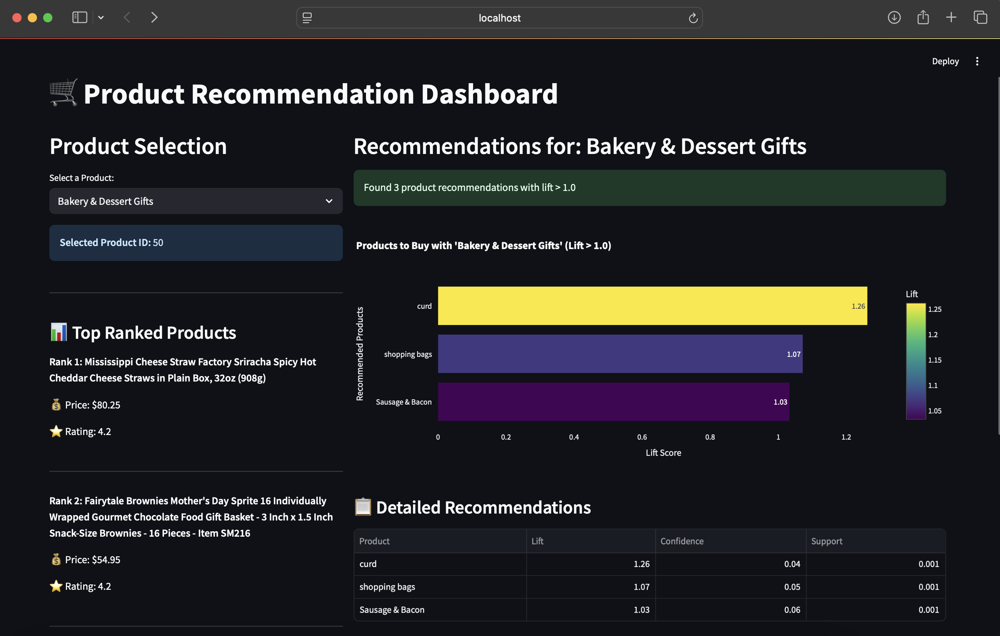
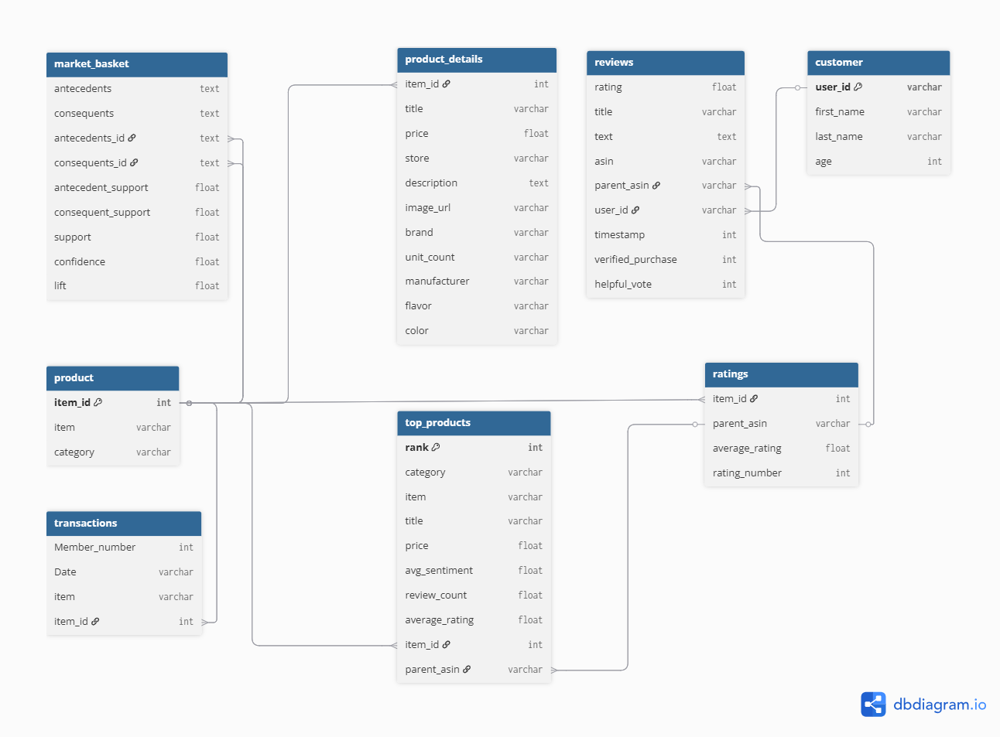

# E-commerce Product Recommendations and Pattern Analysis

## Project Goal

This project combines **Market Basket Analysis** and **Sentiment Analysis** to create an intelligent product recommendation system for e-commerce grocery products. The system analyzes customer purchase patterns using the Apriori algorithm and incorporates customer sentiment from product reviews to provide data-driven product recommendations through an interactive dashboard.

**Key Objectives:**
- Discover frequent itemsets and association rules from transaction data
- Analyze customer sentiment from product reviews
- Build an interactive recommendation dashboard
- Provide actionable insights for cross-selling and product placement strategies

---

## Project Architecture

The project follows a **four-part pipeline**:

```
Part 1: Data Cleaning & Database Creation
    ↓ (produces products.db)
Part 2: Market Basket Analysis
    ↓ (produces product_apriori.db)
Part 3: Sentiment Analysis
    ↓ (produces product_apriori_senti.db)
Part 4: Interactive Dashboard
    ↓ (visualizes insights)
```

---

## Dataset Requirements

Before running the code, ensure you have the following **three CSV files**:

1. **Groceries_dataset.csv** - Transaction data for market basket analysis
2. **meta_Grocery_and_Gourmet_Food.csv** - Product metadata from Amazon
3. **Reviews_Grocery_and_Gourmet_Food.csv** - Customer reviews for sentiment analysis

---

## How to Run the Code

### Prerequisites

Install required Python libraries:

```bash
pip install pandas numpy sqlite3 pyspark streamlit plotly scikit-learn
```

### Step 1: Data Cleaning and Database Creation

**File:** `Final_Part1_Cleaning_CreatingDB.ipynb`

**Input:** 
- `Groceries_dataset.csv`
- `meta_Grocery_and_Gourmet_Food.csv`
- `Reviews_Grocery_and_Gourmet_Food.csv`

**Process:**
- Cleans and preprocesses all three datasets
- Creates unified `item_id` mapping across datasets
- Filters products to match market basket items
- Creates database schema with multiple tables

**Output:** `products.db`

**To Run:**
```bash
jupyter notebook Final_Part1_Cleaning_CreatingDB.ipynb
# Run all cells sequentially
```

---

### Step 2: Market Basket Analysis

**File:** `Final_Part2_Market_Basket_Analysis.ipynb`

**Input:** `products.db`

**Process:**
- Performs Apriori algorithm for frequent itemset mining
- Generates association rules (antecedents → consequents)
- Calculates support, confidence, and lift metrics
- Creates `market_basket` table with recommendation rules

**Output:** `product_apriori.db`

**To Run:**
```bash
jupyter notebook Final_Part2_Market_Basket_Analysis.ipynb
# Run all cells sequentially
```

---

### Step 3: Sentiment Analysis

**File:** `Final_Part3_Sentiment_Analysis.ipynb`

**Input:** `product_apriori.db`

**Process:**
- Analyzes customer reviews for sentiment polarity
- Trains sentiment classification model
- Predicts sentiment scores for products
- Creates `sentiment_predictions` table with results

**Output:** `product_apriori_senti.db`

**To Run:**
```bash
jupyter notebook Final_Part3_Sentiment_Analysis.ipynb
# Run all cells sequentially
```

---

### Step 4: Launch Interactive Dashboard

**File:** `app.py`

**Input:** `product_apriori_senti.db`

**Process:**
- Loads product recommendations and sentiment data
- Creates interactive Streamlit dashboard
- Displays product recommendations with lift scores
- Shows top-ranked products with ratings and prices

**To Run:**
```bash
streamlit run app.py
```

The dashboard will open in your browser at `http://localhost:8501`

---

## Project Methodology

### 1. Data Cleaning & Integration
- **Harmonized datasets** from multiple sources (transaction logs, product metadata, customer reviews)
- Created **item_id mapping** to link products across different datasets
- **Filtered and validated** data to ensure consistency

### 2. Market Basket Analysis (Apriori Algorithm)
- Identified **frequent itemsets** (products commonly purchased together)
- Generated **association rules** with metrics:
  - **Support**: Frequency of itemset occurrence
  - **Confidence**: Likelihood of consequent given antecedent
  - **Lift**: Strength of association (lift > 1 indicates positive correlation)
- Applied minimum thresholds to filter meaningful rules

### 3. Sentiment Analysis
- Preprocessed customer review text (tokenization, cleaning)
- Built **classification model** to predict sentiment polarity
- Scored products based on customer feedback
- Integrated sentiment scores with recommendation system

### 4. Dashboard Development
- Built with **Streamlit** for interactive user experience
- Visualized recommendations using **Plotly** charts
- Enabled product selection and dynamic filtering
- Displayed detailed metrics (lift, confidence, support, ratings)

---

## Key Results & Outputs

### Database Schema

**products.db** contains:
- `transactions` - Customer purchase transactions
- `product` - Product catalog with categories
- `customer` - Customer demographic data
- `ratings` - Product ratings
- `reviews` - Customer review text

**product_apriori.db** adds:
- `market_basket` - Association rules (antecedents, consequents, lift, confidence, support)
- `top_products` - Top-ranked products by category

**product_apriori_senti.db** adds:
- `sentiment_predictions` - Predicted sentiment scores for products

### Dashboard Features

1. **Product Selection Panel**
   - Dropdown menu to select products
   - Displays selected product ID
   - Shows top 3 ranked products with prices and ratings

2. **Recommendation Visualization**
   - Interactive bar chart showing lift scores
   - Sortable table with all recommendation metrics
   - Filters recommendations by lift > 1.0

3. **Market Basket Insights**
   - Identifies products frequently bought together
   - Suggests cross-selling opportunities
   - Helps optimize product placement strategies

---

## Sample Screenshots

### Dashboard Interface
  
### Entity Relationship Diagram showing database structure
  

---

## Dependencies

```
pandas==2.0+
numpy==1.24+
sqlite3 (built-in)
pyspark==3.4+
streamlit==1.28+
plotly==5.17+
scikit-learn==1.3+
```

---

## Project Structure

```
├── Final_Part1_Cleaning_CreatingDB.ipynb    # Data cleaning & DB creation
├── Final_Part2_Market_Basket_Analysis.ipynb # Apriori algorithm
├── Final_Part3_Sentiment_Analysis.ipynb     # Sentiment prediction
├── app.py                                    # Streamlit dashboard
├── products.db                               # Database from Part 1
├── product_apriori.db                        # Database from Part 2
├── product_apriori_senti.db                  # Final database from Part 3
├── Entity_Relation_Diagram.png               # Database schema diagram
├── Project_Report.pdf                        # Detailed project report
└── README.md                                 # This file
```

---

## Future Enhancements

- [ ] Add collaborative filtering for personalized recommendations
- [ ] Implement real-time recommendation updates
- [ ] Integrate with e-commerce platforms via API
- [ ] Add A/B testing framework for recommendation effectiveness
- [ ] Expand to multi-category product recommendations

---

## Contributors

Rutuja Jadhav | Siddhi Nirmale | Keith Fernandes 

